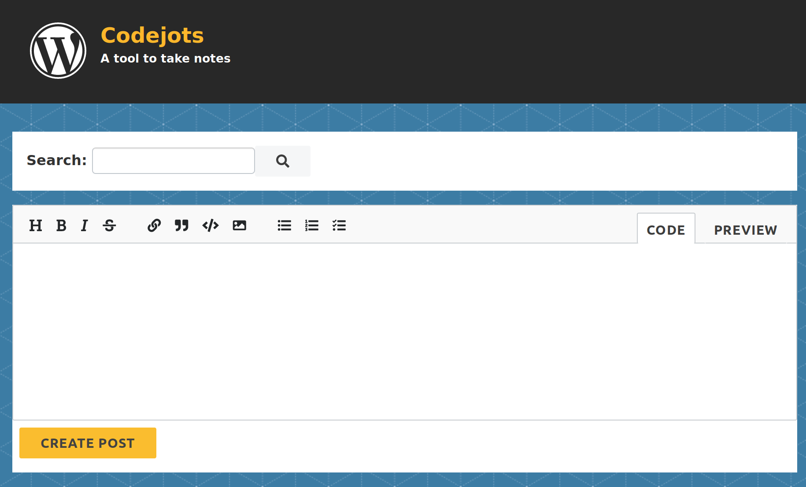

## Codejots

A WordPress theme to capture coding notes, inspired by P2. Implements a front-end markdown editor for being able to quickly jot down a note or comment on other notes.

This is mainly something to play around and tinker on a few concepts.



Note: This theme is a work in progress, I run it on a locally hosted site; multiple users, or public guests have not yet been developed.

### Install

The theme can be installed like a normal WordPress theme, the only requirement is the Gutenberg plug-in since the theme uses the api-request library.

Be warned, Codejots doesn't necessarily play well with Gutenberg posts since there is conversion back-and-forth between markdown and HTML, the Gutenberg comment and markup gets lost.

### Build

Standard Javascript development cycle

```
$ npm install

# for development watch and build
$ npm run dev

# for production build
$ npm run build
```

### Contribute

If you want to iterate on the project any contributions are welcome. See issues list, and please feel free to submit any bug reports.

This theme, like WordPress, is licensed under the GPL.


### Colophon

* Built using [React](https://reactjs.org/), JSX, and [Redux](https://redux.js.org/).

* Uses [Prism.js](https://prismjs.com/) for code syntax highlighting.

* Uses [React Markdown Editor](https://github.com/andrerpena/react-mde)

* Uses [Showdown](https://github.com/showdownjs/showdown) for markdown to html conversion.

* Uses [Turndown](https://github.com/domchristie/turndown) for html to markdown conversion.


